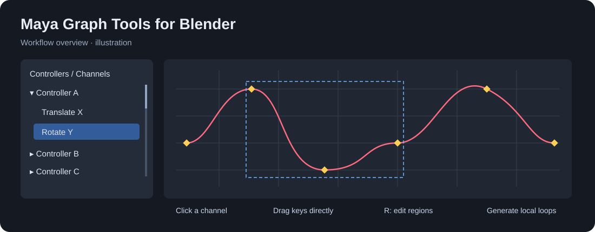

# Maya Graph Tools for Blender

**少花时间管理通道，多花时间把动作调顺。**

这是一个从实际动画工作中逐步打磨出来的 Blender Graph Editor 插件：单击通道、直接拖动关键帧、编辑选区，以及生成同一条时间轴上的局部循环。

[English](README.md) · [使用指南](docs/USER_GUIDE.zh-CN.md) · [下载 v1.26](downloads/MayaGraphTools-1.26.zip)

## 主要优势

- **单击通道，直接聚焦曲线**：位移、旋转、缩放通道集中在左侧；显示隔离不把其他通道永久隐藏，全部通道仍可批量设为自动手柄。
- **控制器栏独立滚动**：固定八行。选中大量控制器也不会把所有设置推到列表最底部。默认展开第一个，其他可手动展开。
- **按住关键帧直接拖动**：默认上下改变数值，按住 Shift 才能同时改变时间和数值。
- **框选只选关键帧**：避免框选过程中只选到手柄。黄色菱形关键帧、小三角手柄更容易区分。
- **R 调出编辑框**：拖动框内移动、拖动边角缩放；支持独立输入上边界、下边界和时间宽度的比例。
- **一键处理局部循环**：以所选关键帧最早与最晚的时间为首尾，不依赖播放区间。根据循环内部相邻关键帧的数值判断拉平波峰波谷或匹配 Free 切线。
- **可选内部平滑**：匹配首尾 → 内部 Auto Clamped → 重算 → 再匹配首尾；保留手调内部切线时可关闭。
- **英文默认，中英日切换**：一个按钮循环切换。问号支持悬停查看解释、点击展开说明。

## 安装和使用

1. 下载 **MayaGraphTools-1.26.zip**，不要把整个 GitHub 源码压缩包当安装包。
2. Blender：Edit → Preferences → Add-ons → Install from Disk，选择 ZIP 并启用 Maya Graph Tools。
3. 升级时先停用旧版；安装、启用后重启 Blender。
4. 在 Graph Editor 顶部点击 **Maya 1.26**，在 Maya Channels 面板开始使用。

[完整中文指南](docs/USER_GUIDE.zh-CN.md)说明各按钮和循环规则。

## 适用范围

已验证 **Windows / Blender 4.4.3 / 64 位**；发布包最低版本设为 Blender 4.4。其他版本、平台尚未验证。

归一化菱形标记和可选细曲线使用带版本检查的 Blender 4.4 适配代码；其他版本的归一化视图保留原生关键点显示，细曲线适配停用。细曲线默认关闭。

循环功能不复制首尾姿势，请先保证首尾数值一致。参与曲线必须在两个边界时间都有真实关键帧；缺少或存在重合端点时会取消操作。启用内部平滑会替换内部手调切线。关键帧数值保持不变，编辑的是原生 F-curves。

欢迎其他动画师试用并提交可复现的问题。请使用可公开分享的最小测试文件。

## 开源协议和制作

GPL-3.0-or-later，见 [LICENSE](LICENSE)。

工作流设计和实际试用来自项目创建者的动画工作，代码实现与 Codex 协作完成。本项目与 Autodesk、Blender Foundation 无隶属关系。
